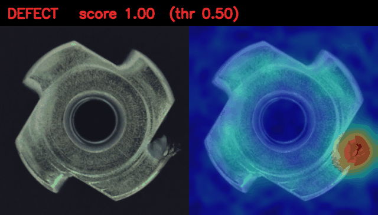
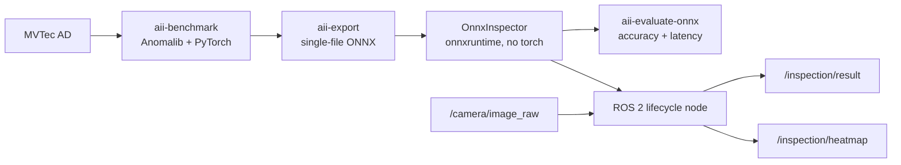

# Industrial Anomaly Inspection

[](https://github.com/adriaangm/industrial-anomaly-inspection/actions/workflows/ci.yaml)

Unsupervised visual anomaly detection for industrial parts, from benchmarking to a GPU-accelerated ROS 2 node.
Models are trained **only on defect-free images** (the realistic industrial setting), exported to ONNX and served by a
torch-free runtime wrapped in a lifecycle ROS 2 node, shipped as a Docker image.



*PatchCore on MVTec AD `metal_nut`: input (left), anomaly heatmap (right), verdict at a 0.5 normalized threshold.*

## Architecture



Training and inference are decoupled through ONNX: the ROS 2 node never imports PyTorch or Anomalib, so the runtime
image stays small and free of the Python dependency conflicts between ROS and deep learning stacks.

## Results

### Benchmark on MVTec AD (RTX 4060 Laptop)

| Image AUROC | PatchCore | PaDiM | EfficientAD* |
|---|---|---|---|
| bottle | 1.000 | 0.998 | 1.000 |
| metal_nut | 0.999 | 0.952 | 0.980 |
| screw | 0.965 | 0.760 | 0.909 |
| transistor | 0.994 | 0.944 | 0.889 |
| **mean** | **0.989** | 0.913 | 0.944 |

| Mean over 4 categories | PatchCore | PaDiM | EfficientAD* |
|---|---|---|---|
| Pixel AUROC | **0.984** | 0.967 | 0.960 |
| Training time [s] | 149 | **5** | 1350 |
| Peak VRAM [MB] | 2983 | **1186** | 2292 |

\* EfficientAD trained for 10k steps (the paper uses 70k): it is undertrained, especially on `transistor`, whose
logical anomalies (missing or misplaced parts) rely on its autoencoder branch.

### ONNX Runtime deployment (`metal_nut`, end-to-end per image incl. preprocessing)

| Model | Image AUROC (ONNX) | GPU p50 | GPU FPS | CPU p50 | Model size |
|---|---|---|---|---|---|
| PatchCore | 0.999 | 18.6 ms | 54 | 276 ms | 359 MB |
| EfficientAD | 0.976 | 10.7 ms | 92 | 601 ms | 31 MB |

ONNX accuracy matches the PyTorch benchmark within ±0.005, confirming that pre/post-processing (including the
normalized threshold) is embedded in the exported graph.

## Design decisions

- **PatchCore as default model.** Best accuracy, and "training" is a single feature-extraction pass (~2 min). Retraining
  on a new part or on synthetic images is cheap, which matters more than the 8 ms latency gap on GPU. EfficientAD is
  kept as the option for edge devices (11x smaller model).
- **Counter-intuitive CPU result.** EfficientAD is faster on GPU but ~2x slower on CPU. Hypothesis (not yet profiled):
  its PDN uses 4x4 convolutions at high resolution, which are far less optimized in ONNX Runtime's CPU kernels than the
  3x3 convolutions of ResNet backbones.
- **Lifecycle node.** The ONNX session is created in `on_configure` and the camera subscription in `on_activate`, so the
  node can be supervised like Nav2 components. The launch files configure and activate it automatically.
- **Sensor QoS with depth 1.** If inference is slower than the camera, stale frames are dropped instead of queued:
  inspection only cares about the latest part.
- **Venv with `--system-site-packages` for ROS.** `onnxruntime-gpu` is not packaged in apt, so the node runs in a venv
  that also sees `rclpy` and `cv_bridge`. Two pitfalls solved along the way: NumPy is pinned to `<2` to match the ABI
  of apt's `cv_bridge`, and packages are built with `python3 -m colcon` so entry-point shebangs point to the venv.

## Quickstart

### 1. Training, benchmark and export (host, uv)

```bash
uv sync --extra train
uv run aii-benchmark --models patchcore padim          # results/benchmark/summary.md
uv run aii-export --model patchcore --category metal_nut
uv run aii-evaluate-onnx --model-path models/patchcore_metal_nut.onnx --category metal_nut
```

MVTec AD is downloaded automatically by Anomalib to `~/datasets/MVTecAD` (license CC BY-NC-SA 4.0, not redistributed here).

### 2. ROS 2 node (Jazzy, Ubuntu 24.04)

```bash
python3 -m venv --system-site-packages ~/ros2_ws/.venv_inspection
source ~/ros2_ws/.venv_inspection/bin/activate
pip install -e . --no-deps
pip install "numpy>=1.26,<2" "onnxruntime-gpu[cuda,cudnn]>=1.22"

ln -s $PWD/ros2/anomaly_inspection_msgs ~/ros2_ws/src/
ln -s $PWD/ros2/anomaly_inspection_ros ~/ros2_ws/src/
cd ~/ros2_ws && source /opt/ros/jazzy/setup.bash
python3 -m colcon build --packages-select anomaly_inspection_msgs anomaly_inspection_ros --symlink-install
source install/setup.bash

# Demo with a simulated camera replaying MVTec test images
ros2 launch anomaly_inspection_ros inspection.launch.py model_path:=/abs/path/models/patchcore_metal_nut.onnx
```

### 3. Docker (GPU runtime, no torch)

```bash
docker build -t industrial-anomaly-inspection .
docker run --rm --gpus all -v $PWD/models:/models:ro industrial-anomaly-inspection
```

Requires the NVIDIA Container Toolkit. The container runs the production launch file (inspection node only) and
listens on `/camera/image_raw`.

## Interfaces

| Topic | Type | Description |
|---|---|---|
| `/camera/image_raw` (sub) | `sensor_msgs/Image` | Input frames |
| `/inspection/result` (pub) | `anomaly_inspection_msgs/InspectionResult` | Score, verdict, threshold, latency, source header |
| `/inspection/heatmap` (pub) | `sensor_msgs/Image` | Heatmap overlay for RViz |

## Project structure

```
src/anomaly_inspection/       benchmark, export and torch-free runtime (OnnxInspector)
ros2/anomaly_inspection_msgs/ InspectionResult message
ros2/anomaly_inspection_ros/  lifecycle node, MVTec image publisher, launch files
configs/benchmark.yaml        benchmark definition (models x categories)
tests/                        runtime unit tests (synthetic ONNX model, CPU-only, run in CI)
Dockerfile                    GPU runtime image
```

## Roadmap

- Pick-and-place sorting cell in Gazebo with MoveIt 2, using this node to reject defective parts
- Retraining on synthetic Gazebo images to close the sim-to-real domain gap
- TensorRT execution provider and FP16 export
